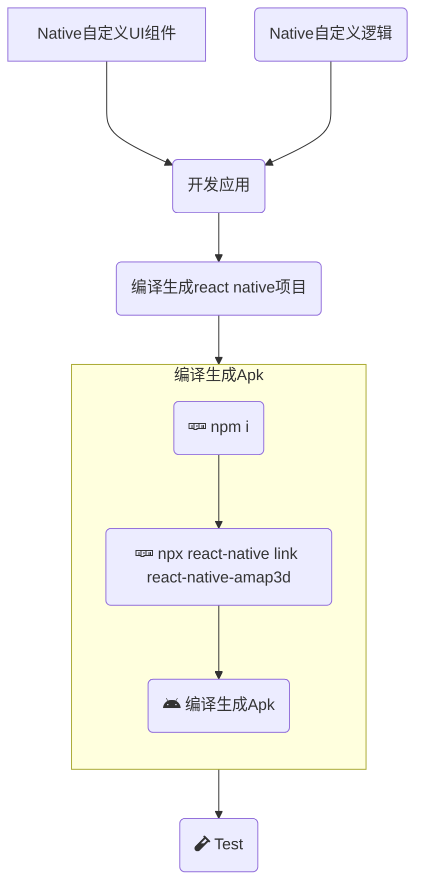

# 开发流程

```mermaid
flowchart TD
    CUI[Native自定义UI组件]
    CLogic(Native自定义逻辑)
    Dev(开发应用)
    Bundle(编译生成react native项目)
    subgraph 编译生成Apk
        direction TB
        GG(fab:fa-android 编译生成Apk)
        G1Link(fab:fa-npm npx react-native link react-native-amap3d)-->GG
        GF(fab:fa-npm npm i)-->G1Link
    end
    CUI--->Dev
    CLogic--->Dev
    Dev-->Bundle
    Bundle-->编译生成Apk
    编译生成Apk-->Test(fas:fa-vial Test)
```

# [自定义UI组件](/custom/ui/)
# 自定义逻辑组件